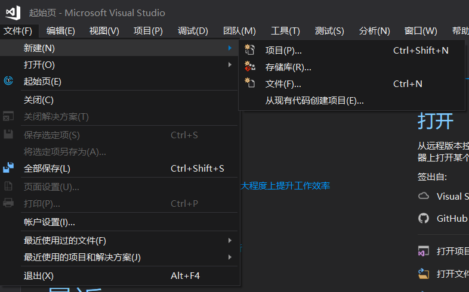
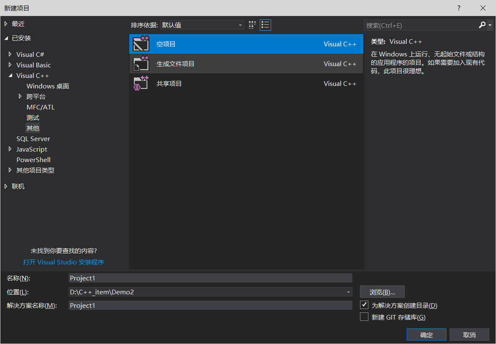
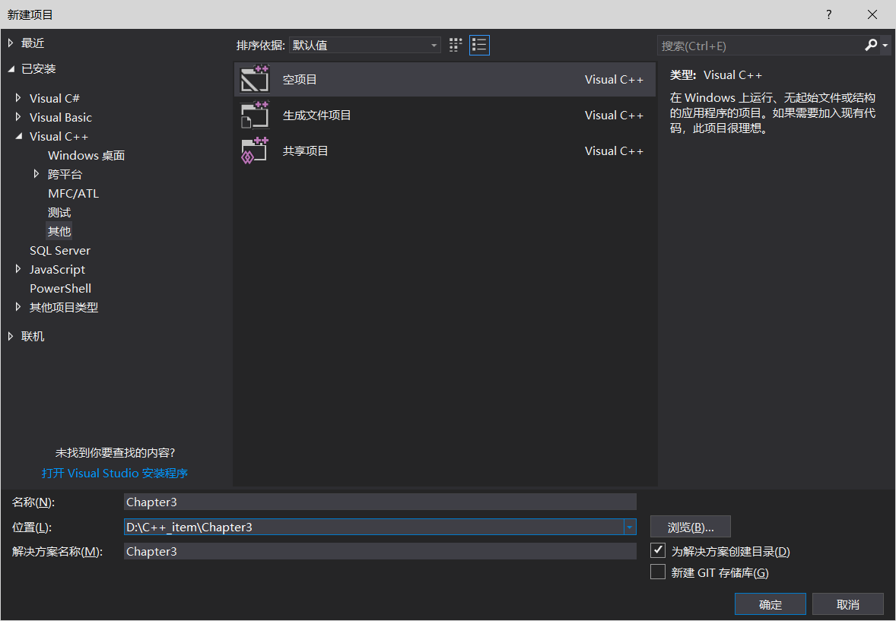
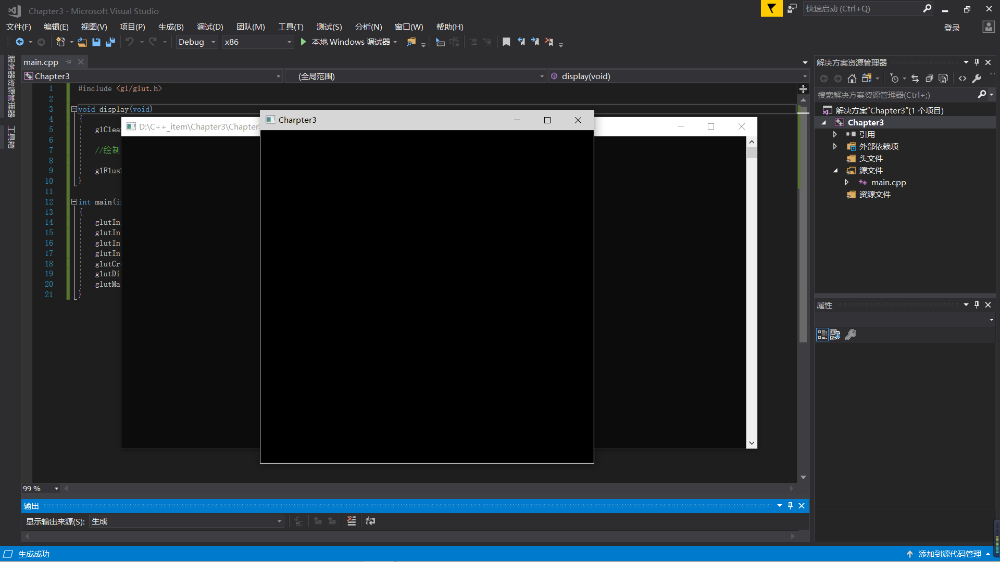
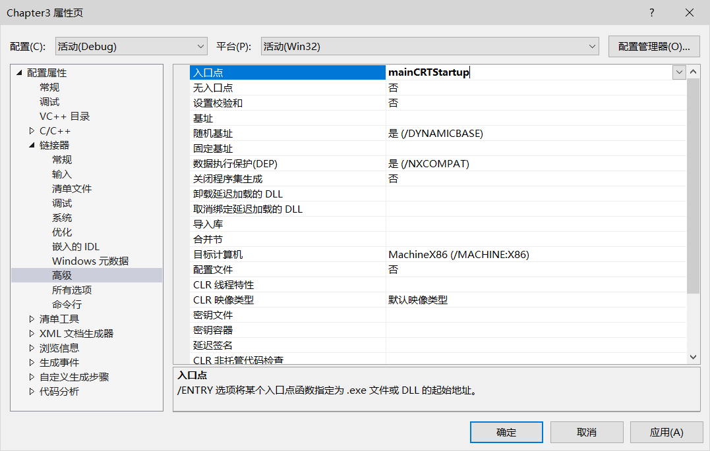
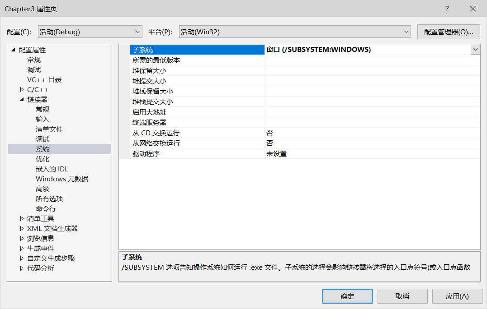
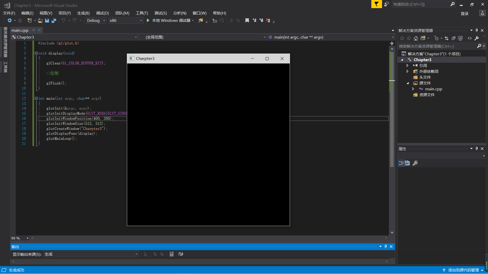

**Visual Studio 2017**

**新建项目**

选择空项目

选择存储位置并修改名称

右键点击源文件添加-> 新建项 -> C++文件（.cpp）

然后创建包含头文件glut.h  
    
代码如下：

    #include <gl/glut.h>
    
    void display(void)
    {
    	glClear(GL_COLOR_BUFFER_BIT);
    
    	//绘制
    
    	glFlush();
    }
    
    int main(int argc, char** argv)
    {
    	glutInit(&argc, argv);
    	glutInitDisplayMode(GLUT_RGBA|GLUT_SINGLE);
    	glutInitWindowPosition(400, 200);
    	glutInitWindowSize(512, 512);
    	glutCreateWindow("Charpter3");
    	glutDisplayFunc(display);
    	glutMainLoop();
    }

代码运行图：

配置无控制台模式

点击 项目-> 属性 -> 链接器 -> 高级

更改入口点 **mainCRTStartup**

点击 系统, 子系统:**窗口（/SUBSYSTEM:WINDOWS）**

确定，再次运行结果如下

