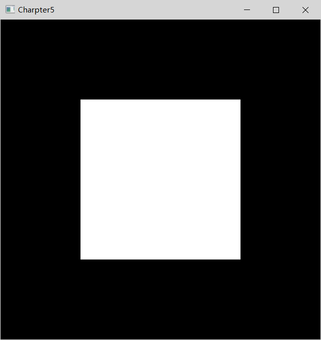
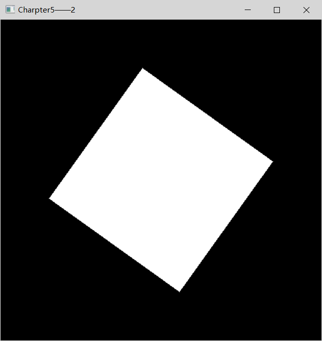

	#include <gl/glut.h>
	#define w 512
    #define h 512
	void display(void)
	{
    	//指定清屏颜色
    	glClearColor(0.0,0.0,0.0,0.0);

		//清屏
		glClear(GL_COLOR_BUFFER_BIT);

		//初始化视景体
    	glMatrixMode(GL_PROJECTION);
    	glLoadIdentity();
    	glOrtho(0.0,1.0,0.0,1.0,-1.0,1.0);

    	//绘制
    	glColor3f(1.0,1.0,1.0);//颜色

    	glBegin(GL_POLYGON);//多边形模式

    		glVertex3f(0.25f,0.25f,0.0f);
    		glVertex3f(0.75f,0.25f,0.0f);
    		glVertex3f(0.75f, 0.75f, 0.0f);
    		glVertex3f(0.25f, 0.75f, 0.0f);
    
    	glEnd();
    	glFlush()

	int main(int argc, char** argv)
    {
    	glutInit(&argc, argv);
    	glutInitDisplayMode(GLUT_RGBA|GLUT_SINGLE);
    	glutInitWindowPosition(400, 200);
    	glutInitWindowSize(w, h);
    	glutCreateWindow("Charpter5——1");
    	glutDisplayFunc(display);
    	glutMainLoop();
    }

运行结果：

 

	#include <gl/glut.h>
    #define w 512
    #define h 512
    static GLfloat spin = 0.0f;
    
    void display(void)
    {
    	//指定清屏颜色
    	glClearColor(0.0,0.0,0.0,0.0);
    	glClear(GL_COLOR_BUFFER_BIT);
		
		//单色模式
		glShadeModel(GL_FLAT);
    	glPushMatrix();
	
		//旋转
    	glRotatef(spin,0.0,0.0,1.0);
    	glRectf(-25.0,-25.0,25.0,25.0);
    	glPopMatrix();

    	glutSwapBuffers();
    	
    }
    
    void spinDisplay() {
    	spin = spin + 0.1;
    	if (spin > 360.0) 
    	{
    		spin = spin - 360.0;
    	}
    	glutPostRedisplay();
    }
    
    void reshape(int W,int H) {
    	glViewport(0,0,(GLsizei)W,(GLsizei)H);
    	glMatrixMode(GL_PROJECTION);
    	glLoadIdentity();
    	glOrtho(-50.0,50.0,-50.0,50.0,-1.0,1.0);
    	glMatrixMode(GL_MODELVIEW);
    	glLoadIdentity();
    
    }
    
    
    void mouse(int button,int state ,int x,int y ) {
    
    	switch (button)
    	{
    	case GLUT_LEFT_BUTTON:
    
    		if (state == GLUT_DOWN)
    		{
    			glutIdleFunc(spinDisplay);
    		}
    		break;
    	case GLUT_RIGHT_BUTTON:
    		if (state == GLUT_DOWN) 
    		{	
    			glutIdleFunc(nullptr);
    		}
    		break;
    
    	default:
    			break;
    	}
    
    }
    
    
    int main(int argc, char** argv)
    {
    	glutInit(&argc, argv);
    	glutInitDisplayMode(GLUT_RGBA|GLUT_DOUBLE);
    	glutInitWindowPosition(400, 200);
    	glutInitWindowSize(w, h);
    	glutCreateWindow("Charpter5——2");
    	glutDisplayFunc(display);
    	glutReshapeFunc(reshape);
    	glutMouseFunc(mouse);
    	glutMainLoop();
    }

点左键开始旋转 	&nbsp;&nbsp;&nbsp;&nbsp;&nbsp;&nbsp;&nbsp;&nbsp;&nbsp;&nbsp;&nbsp;&nbsp;&nbsp;&nbsp;&nbsp;&nbsp;&nbsp;&nbsp;&nbsp;&nbsp;&nbsp;&nbsp;&nbsp;&nbsp;|&nbsp;&nbsp;&nbsp;&nbsp;&nbsp;&nbsp;&nbsp;&nbsp;&nbsp;&nbsp;&nbsp;&nbsp;&nbsp;&nbsp;&nbsp;&nbsp;&nbsp;&nbsp;&nbsp;&nbsp;&nbsp;&nbsp;&nbsp; &nbsp;点右键暂停旋转
 
 

运行结果：

<h1>函数</h1> 

	glutReshapeFunc();